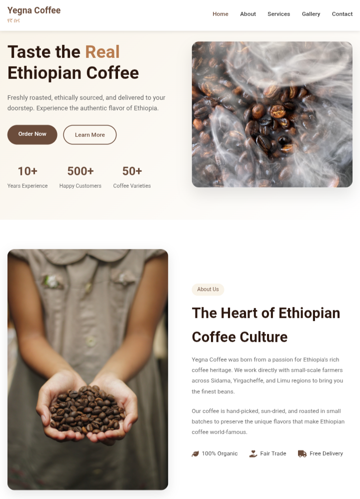
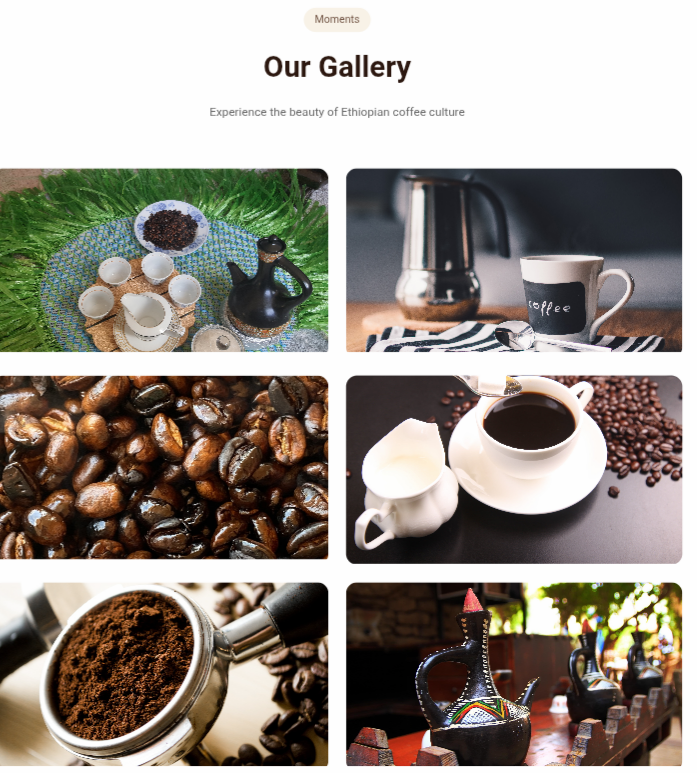

# ☕ Yegna Coffee – Premium Ethiopian Coffee

> A modern, responsive business landing page for a premium Ethiopian coffee brand.  
> Built with HTML, CSS, JavaScript, and PHP – designed to showcase products, services, and a contact form.

🔗 **[Live Demo](https://amardelil.github.io/yegna-coffee)**  
## 📸 Screenshots

| Hero Section | Gallery |
|:------------:|:-------:|
|  |  |

---

## ✨ Features

- ✅ **Fully responsive** – works on all devices (mobile, tablet, desktop)
- ✅ **Smooth scrolling & active nav highlighting**
- ✅ **Interactive gallery** with hover effects
- ✅ **Contact form** with AJAX submission and PHP backend
- ✅ **WhatsApp floating button** for quick contact
- ✅ **Ethiopian coffee culture** theme with Amharic text
- ✅ **Real coffee images** – no placeholder images

---

## 🛠️ Technologies Used

| Technology | Purpose |
|------------|---------|
| **HTML5** | Semantic structure |
| **CSS3** | Custom styling, animations, responsive |
| **JavaScript (ES6)** | Interactivity (mobile menu, scroll, form submission) |
| **PHP** | Backend contact form processing |
| **Font Awesome** | Icons |
| **Pexels/Imgur** | Free coffee images |

---

## 📁 Project Structure

```
yegna-coffee/
├── index.html          # Main page
├── style.css           # All styles
├── script.js           # JavaScript interactions
├── contact.php         # PHP form handler
├── images/             # Screenshots & coffee images
│   ├── hero.png        # Hero section preview
│   ├── gallery.png     # Gallery preview
│   ├── hero-coffee.jpg # Hero coffee image
│   ├── about-coffee.jpg # About section image
│   ├── gallery-1.jpg   # Gallery image 1
│   ├── gallery-2.jpg   # Gallery image 2
│   ├── gallery-3.jpg   # Gallery image 3
│   ├── gallery-4.jpg   # Gallery image 4
│   ├── gallery-5.jpg   # Gallery image 5
│   └── gallery-6.jpg   # Gallery image 6
└── README.md           # This file
```

---

## 🚀 How to Run Locally

### Option 1: Static HTML (No PHP)
1. **Clone** the repository:
   ```bash
   git clone https://github.com/amardelil/yegna-coffee.git
   ```
2. Open `index.html` in any modern browser.

### Option 2: With PHP Form (Recommended)
1. Install **XAMPP** or **MAMP** on your computer.
2. Place the project folder in `htdocs` (XAMPP) or `www` (MAMP).
3. Start Apache server.
4. Open `http://localhost/yegna-coffee/index.html` in your browser.

---

## 📬 Connect with Me

- **GitHub** – [amardelil](https://github.com/amardelil)
- **Telegram** – [@amardelil](https://t.me/+251992156362)

---

## 📄 License

This project is open‑source under the [MIT License](LICENSE).

---

*Built with ❤️ by Amar Delil*
